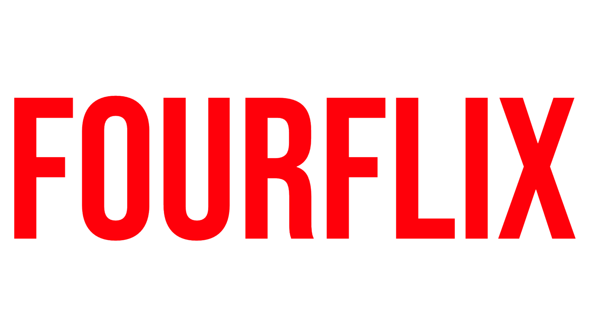

<a name="readme-top"></a>
[![Contributors][contributors-shield]][contributors-url]
[![Forks][forks-shield]][forks-url]
[![Stargazers][stars-shield]][stars-url]
[![Issues][issues-shield]][issues-url]
[![GNU License][license-shield]][license-url]
[![LinkedIn][linkedin-shield]][linkedin-url]


<!-- PROJECT LOGO -->
<br />
<div align="center">
  <a href="https://github.com/FalconEthics/OTT-Platform-FOURFLIX">
    
  </a>

  <h3 align="center">FOURFLIX - OTT Platform</h3>

  <p align="center">
    Create your own ott platform in just a few clicks!
    <br />
    <a href="https://github.com/FalconEthics/OTT-Platform-FOURFLIX"><strong>Explore the docs »</strong></a>
    <br />
    <br />
    <a href="https://fourflix.vercel.app/login.html">View Demo</a>
    ·
    <a href="https://github.com/FalconEthics/OTT-Platform-FOURFLIX/issues">Report Bug</a>
    ·
    <a href="https://github.com/FalconEthics/OTT-Platform-FOURFLIX/issues">Request Feature</a>
  </p>
</div>

## <a href="https://fourflix.vercel.app/login.html">Open Site</a>
Login Id & PASS: demo


<!-- ABOUT THE PROJECT -->
## About The Project
<details>
  <summary>Table of Contents</summary>
  <ol>
    <li>
      <a href="#about-the-project">About The Project</a>
      <ul>
        <li><a href="#built-with">Built With</a></li>
      </ul>
    </li>
    <li><a href="#usage">Usage</a></li>
    <li><a href="#roadmap">Roadmap</a></li>
    <li><a href="#contributing">Contributing</a></li>
    <li><a href="#license">License</a></li>
    <li><a href="#contact">Contact</a></li>
    <li><a href="#acknowledgments">Acknowledgments</a></li>
  </ol>
</details>

[![Product Name Screen Shot][product-screenshot]](https://github.com/FalconEthics/OTT-Platform-FOURFLIX)

FourFlix is a content sharing platform where people can share their own content and make it discoverable to their audience. The core concept of FourFlix is to provide individual content paging for every uploader while staying server-free/low maintenance and make it stand out from the crowd being a discrete entity. The concept of OTT platforms or Digital Content Libraries isn’t new but our approach to it is. Unlike other video libraries available in the market like YouTube or VIMO it doesn’t mix all the contents uploaded to it instead it makes separate pages for each and every content creator, so that audience of one content creator will only get the videos uploaded by that individual creator only. FourFlix also provides some rich features of top OTT platforms like NETFLIX, PRIVE VIDEO, etc. with ease whereas on those platforms only big registered production houses and companies can post. In this way both the Content Creator and Content Consumer can enjoy the goods of both sides and cons of none. [Initially it was my final year project when i was doing my diploma in computer science engineering from Central Institute of Technology India] 

<p align="right">(<a href="#readme-top">back to top</a>)</p>


### Built With

Here are all the components used in the build.

* [![HTML][Html.com]][Html-url] - Base
* [![CSS][Css.com]][Css-url] - Styling
* [![JS][Es6.com]][Es6-url] - Logic
* [![Bootstrap][Bootstrap.com]][Bootstrap-url] - Late Impimentation
* [![JQuery][JQuery.com]][JQuery-url] Late Impimentation
* [![Affinity][Affinity.com]][Affinity-url] - GFX
* [![Davinci][Davinci.com]][Davinci-url] - Animations
* [![Git][Git.com]][Git-url] - Deployment

<p align="right">(<a href="#readme-top">back to top</a>)</p>


<!-- USAGE EXAMPLES -->
## Usage

FOUFLIX is an OTT Platform where people can upload videos and share it with their respective audience, unlike other video libraries available in the market like YouTube or VIMO it doesn’t mix all the contents uploaded to it instead it makes separate pages for each and every content creator, so that audience of one content creator will only get the videos uploaded by that individual creator only. Every uploader have their discrete page of FOURFLIX and users may switch links as their wish whenever they want. It helps individual content creator to make their content more discoverable and standout from the crowd. With FOURFLIX one can customize their page as much as they want and the way they want their contents to be displayed, with google ads plugin, creators can also monetize their page and make income from it from the very first day of start whereas in platforms like YouTube one can start earning only after compiling their criteria which takes decent amount of time. FourFlix also provides some rich features of top OTT platforms like NETFLIX, PRIVE VIDEO, etc. with ease whereas on those platforms only big registered production houses and companies can post. Because of its high customizability and less complexity, it can serve the content to the viewers without any need of high-end servers. Being server-free is one of the core features of FourFlix, it takes user input of content through its admin page and embedded’s the link to its page in such a way that although the viewer will be consuming the content through FOUFLIX it will be using the resources of the drive that the link is shared from.

For more indepth info about my project, please refer to my project report that was submitted by our group in the final sem of my institute [Documentation](https://github.com/FalconEthics/OTT-Platform-FOURFLIX/blob/main/ProjectReport.pdf)

<p align="right">(<a href="#readme-top">back to top</a>)</p>


<!-- ROADMAP -->
## Roadmap

I started this project in the very early stage of my web development carrier, I didn't knew any proper javascript or css framwork other then a few libraies like Jquery and bootstrap and i was focusing on learning the frontend part mainly but now when i have all the required skills to build it , i don't have enough time to spent in it so here's the roadmap that i will be following and will be working on to complete this project in near future:

- [x] Base Structure
- [x] Netflix inspired colour scheme & Front-End
- [ ] Implement React.js Framework
- [ ] Replace Vannila css and Bootstrap with Tailwind CSS
- [ ] Build the Backend
    - [ ] API intergration
    - [ ] Proper Deployment with payment gateway and user database

See the [open issues](https://github.com/FalconEthics/OTT-Platform-FOURFLIX/issuess) for a full list of proposed features (and known issues).

<p align="right">(<a href="#readme-top">back to top</a>)</p>


<!-- CONTRIBUTING -->
## Contributing

Contributions are what make the open source community such an amazing place to learn, inspire, and create. Any contributions you make are **greatly appreciated**.

If you have a suggestion that would make this better, please fork the repo and create a pull request. You can also simply open an issue with the tag "enhancement".
Don't forget to give the project a star! Thanks again!

1. Fork the Project
2. Create your Feature Branch 
 ```sh
git checkout -b feature/AmazingFeature
```
3. Commit your Changes 
```s
git commit -m Add some AmazingFeature
```
4. Push to the Branch 
```s
git push origin feature/AmazingFeature
```
5. Open a Pull Request

<p align="right">(<a href="#readme-top">back to top</a>)</p>


<!-- LICENSE -->
## License

Distributed under the GNU License. See `LICENSE.txt` for more information.

<p align="right">(<a href="#readme-top">back to top</a>)</p>


<!-- CONTACT -->
## Contact

Soumik Das - [Twitter](https://twitter.com/SoumikD95642409) / [INSTA](https://www.instagram.com/itz.raaj.das/) / [Linkedlin](https://www.linkedin.com/in/soumik-das-profile/)

Project Link: [https://github.com/FalconEthics/OTT-Platform-FOURFLIX](https://github.com/FalconEthics/OTT-Platform-FOURFLIX)

<p align="right">(<a href="#readme-top">back to top</a>)</p>


## Acknowledgments

 -Initially it was my final year project when i was doing my diploma in computer science engineering from Central Institute of Technology India

<!-- MARKDOWN LINKS & IMAGES -->
<!-- https://www.markdownguide.org/basic-syntax/#reference-style-links -->
[contributors-shield]: https://img.shields.io/github/contributors/FalconEthics/OTT-Platform-FOURFLIX.svg?style=for-the-badge
[contributors-url]: https://github.com/FalconEthics/OTT-Platform-FOURFLIX/graphs/contributors
[forks-shield]: https://img.shields.io/github/forks/FalconEthics/OTT-Platform-FOURFLIX.svg?style=for-the-badge
[forks-url]: https://github.com/FalconEthics/OTT-Platform-FOURFLIX/network/members
[stars-shield]: https://img.shields.io/github/stars/FalconEthics/OTT-Platform-FOURFLIX.svg?style=for-the-badge
[stars-url]: https://github.com/FalconEthics/OTT-Platform-FOURFLIX/stargazers
[issues-shield]: https://img.shields.io/github/issues/FalconEthics/OTT-Platform-FOURFLIX.svg?style=for-the-badge

[issues-url]: https://github.com/FalconEthics/OTT-Platform-FOURFLIX/issues
[license-shield]: https://img.shields.io/github/license/FalconEthics/OTT-Platform-FOURFLIX.svg?style=for-the-badge

[license-url]: https://github.com/FalconEthics/OTT-Platform-FOURFLIX/blob/main/LICENSE
[linkedin-shield]: https://img.shields.io/badge/-LinkedIn-black.svg?style=for-the-badge&logo=linkedin&colorB=555

[linkedin-url]: https://www.linkedin.com/in/soumik-das-profile/

[product-screenshot]: https://raw.githubusercontent.com/FalconEthics/OTT-Platform-FOURFLIX/main/Screenshot.png
<!-- [product-screenshot2]: https://raw.githubusercontent.com/FalconEthics/OTT-Platform-FOURFLIX/main/Trinetro_Drone_2022-Sep-03_04-16-58AM-000_CustomizedView13304029920.png
[product-screenshot3]: https://raw.githubusercontent.com/FalconEthics/OTT-Platform-FOURFLIX/main/Trinetro_Drone_2022-Sep-03_04-18-29AM-000_CustomizedView9151492485.png
[product-screenshot4]: https://raw.githubusercontent.com/FalconEthics/OTT-Platform-FOURFLIX/main/Trinetro_Drone_2022-Sep-03_04-22-00AM-000_CustomizedView12173695879.png
[product-components]: https://raw.githubusercontent.com/FalconEthics/OTT-Platform-FOURFLIX/main/Components.png -->


[Bootstrap.com]: https://img.shields.io/badge/Bootstrap-563D7C?style=for-the-badge&logo=bootstrap&logoColor=white
[Bootstrap-url]: https://getbootstrap.com
[JQuery.com]: https://img.shields.io/badge/jQuery-0769AD?style=for-the-badge&logo=jquery&logoColor=white
[JQuery-url]: https://jquery.com
[Es6.com]: https://img.shields.io/badge/ECMAScript6-7BDCB5?style=for-the-badge&logo=javascript&logoColor=white
[Es6-url]: https://es6.io/
[Html.com]: https://img.shields.io/badge/HTML5-8ED1FC?style=for-the-badge&logo=H&logoColor=white
[Html-url]: https://html.com/html5/
[Css.com]: https://img.shields.io/badge/Custom_CSS-8ED1FC?style=for-the-badge&logo=C&logoColor=white
[Css-url]: http://css.com/
[Affinity.com]: https://img.shields.io/badge/Affinity_Designer-9900EF?style=for-the-badge&logo=adobe&logoColor=white
[Affinity-url]: https://affinity.serif.com/en-us/
[Davinci.com]: https://img.shields.io/badge/Davinci_Resolve_Studio-0693E3?style=for-the-badge&logo=D&logoColor=white
[Davinci-url]: https://www.blackmagicdesign.com/products/davinciresolve/
[Git.com]: https://img.shields.io/badge/Github_Pages-FF6900?style=for-the-badge&logo=git&logoColor=white
[Git-url]: https://pages.github.com/
